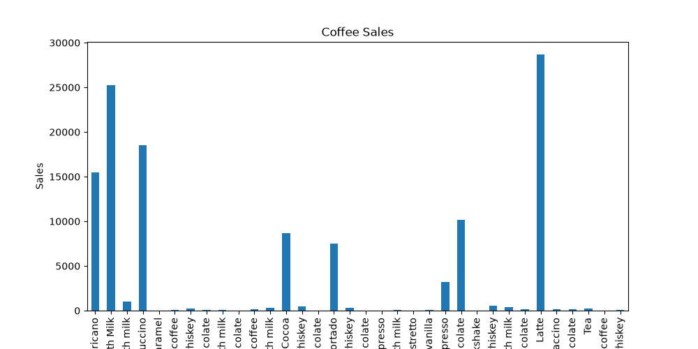
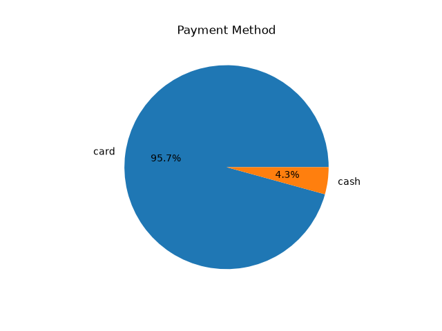
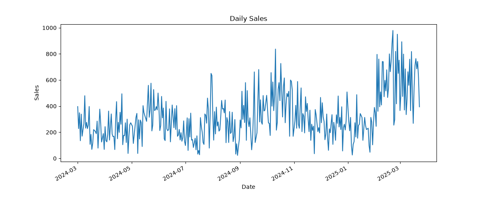

# ☕ Coffee Shop Sales Analysis

## Project Overview

This project analyzes coffee shop sales data using Python, Pandas, Matplotlib, and SQL. The analysis identifies sales trends, payment methods, and the best-selling coffee products.

## Tools Used

- Python
- Pandas
- Matplotlib
- SQL
- Jupyter Notebook


- ## Features

- Data Cleaning
- Data Analysis
- SQL Queries
- Charts
- Business Insights

- ## Business Insights

- Identified top-selling coffee products.
- Calculated total revenue.
- Compared payment methods.
- Analyzed daily sales trends.

## How to Run

```bash
python src/data_cleaning.py
python src/analysis.py
```

## Folder Structure

See repository folders for code, SQL queries, and generated images.


## Project Dashboard

### Overall Coffee Sales


### Top Selling Products



### Payment Methods



### Daily Sales Trend



## Key Insights

- Analyzed coffee sales transactions.
- Compared payment methods.
- Identified top-selling coffee products.
- Visualized daily sales trends.
- Cleaned and prepared data for analysis.
